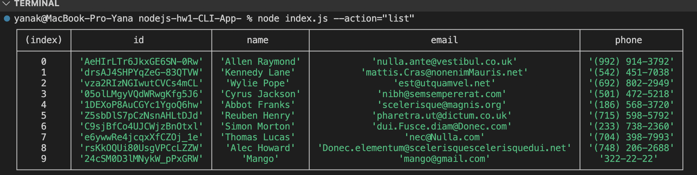
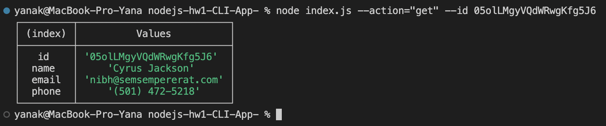
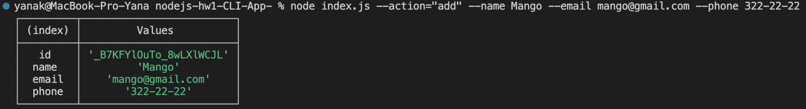
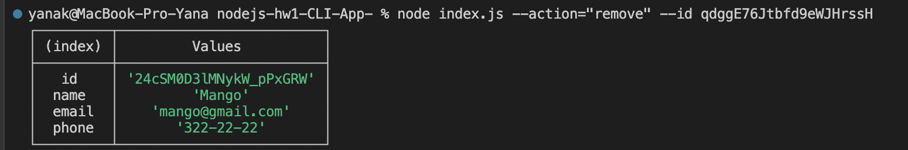
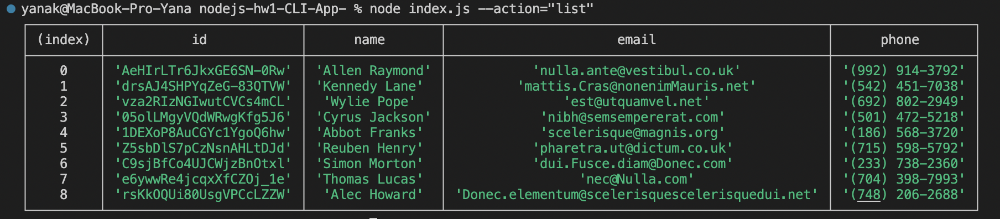

# nodejs-hw1-CLI-App-

# Отримуємо і виводимо весь список контактів у вигляді таблиці (console.table)

# Отримуємо контакт по id

# Додаємо контакт

# Видаляємо контакт

# Список контактів після всіх дій
